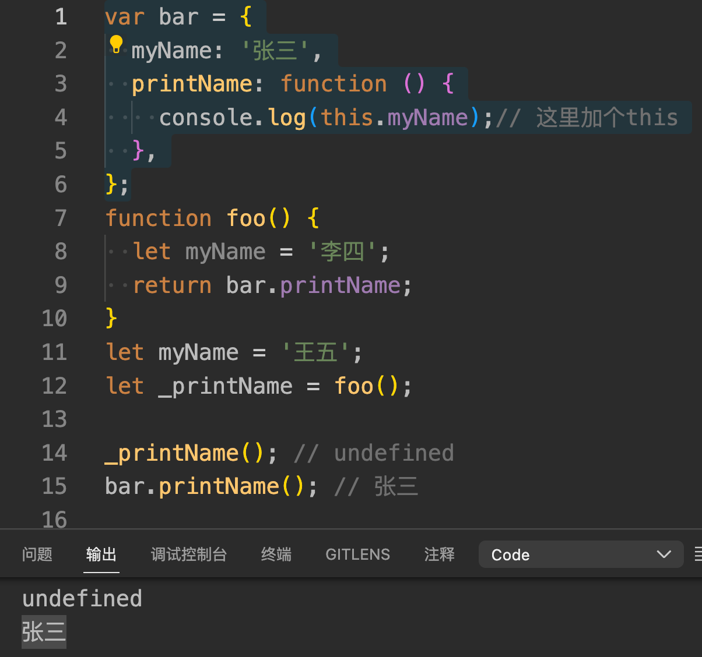
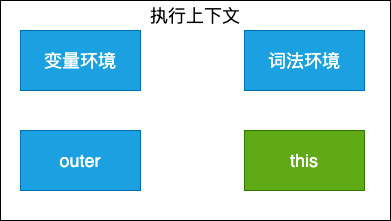
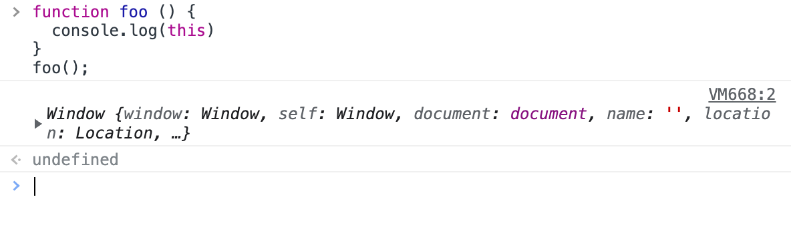
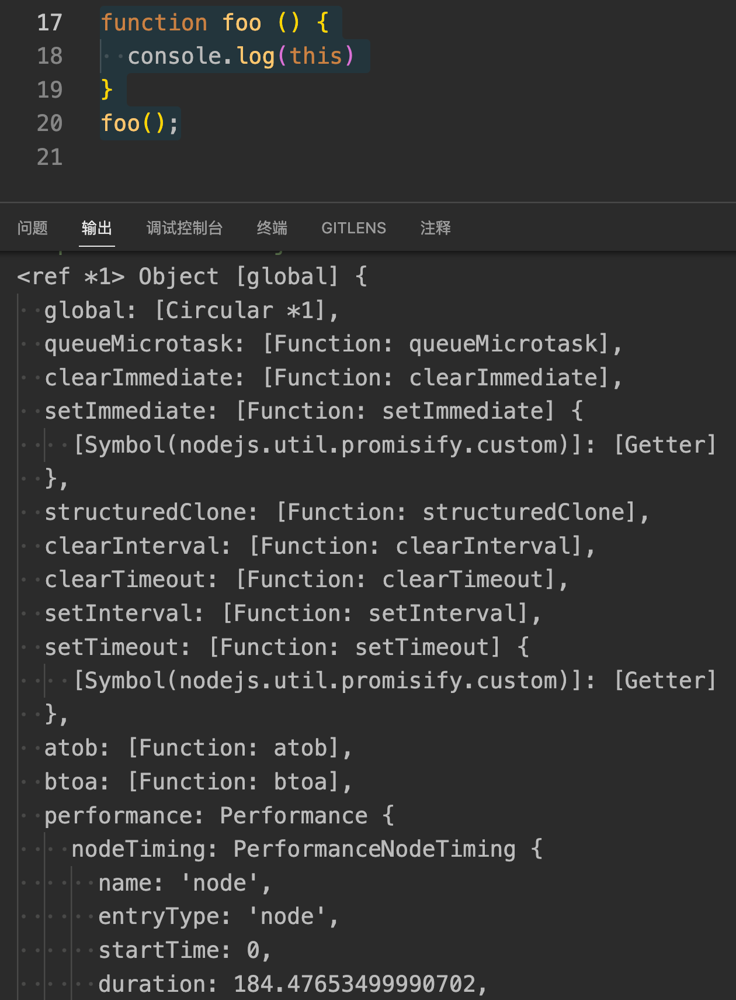

### 为什么要出现this机制？
```javascript
var bar = {
  myName: '张三',
  printName: function () {
    console.log(myName);
  },
};
function foo() {
  let myName = '李四';
  return bar.printName;
}
let myName = '王五';
let _printName = foo();

_printName(); // 王五
bar.printName(); // 王五

```

上面的代码中输出的都是`王五`,不过按照常理来说，调用`bar.printName`方法时,该方法内部的变量`myName`应该使用bar对象中的,因为它们是一个整体,大多数面向对象的语言都是这样设计的,比如在C++ 中,同样调用`bar`对象的`printName`方法,最终打印出来的就是`bar`对象的内部变量`myName`的值——'张三',而不是外部定义变量`myName`的值——`王五`。

**在对象内部的方法中使用对象内部的属性是一个非常普遍的需求**,但是JavaScript的作用域机制并不支持这一点,基于这个需求,JavaScript又搞出来另外一套**this机制**.

所以,在JavaScript中可以使用this实现在`printName`函数中访问到`bar`对象的`myName`属性了,具体变动如下：
```javascript
var bar = {
  myName: '张三',
  printName: function () {
    console.log(this.myName);// 这里加个this
  },
};
```



### JavaScript中的this是什么？
this是和执行上下文绑定的,每个执行上下文都有一个this.



执行上下文主要分为三种——全局执行上下文、函数执行上下文和eval执行上下文,所以对应的this也只有这三种——全局执行上下文中的this、函数中的this和eval中的this.


重点需要了解的是全局上下文中的this和函数中的this。

#### 全局上下文中的this
在控制台中console.log(this)打印出来的是window对象,所以可以得出结论,全局上下文中的this指向window对象。

#### 函数执行上下文的this
在浏览器和node环境中分别执行下面这段代码
```javascript
function foo(){
  console.log(this)
}
foo()
```
在控制台输出的结果：



在node环境输出的结果


这说明在默认情况下,调用一个函数,其执行上下文的this是指向该环境的全局对象的。

那么，能不能设置函数的执行上下文的this指向其他对象呢？ 答案是肯定的。目前有三种方式可以改变this执向。

#### 1. call、apply、bind方法
```javascript
var bar = {
  myName: '张三',
  printName: function () {
    console.log(this.myName);// 这里加个this
  },
};
const b = {
  myName: '李四',
};
bar.printName.call(b); // 李四，call绑定优先级高于对象调用

let myName = "王五"
function foo(){
  console.log(this.myName);
}
foo.call(bar);// 张三
foo.call(b);//李四
```
#### 2. 通过对象调用
```javascript
var bar = {
  myName: '张三',
  printName: function () {
    console.log(this.myName);// 这里加个this
  },
};

bar.printName(); // 张三
```
使用对象来调用其内部的一个方法,该方法的this是指向对象本身的。
#### 3. new 构造函数调用
```javascript
let myName = "王五"

function foo(myName){
  this.myName = myName;
}

const newObj = new foo('张六');
console.log(newObj.myName); // 张六
```

**使用new 来调用函数,或者说发生构造函数调用时,会自动执行下面的操作**

1.创建(或者说)构造一个全新的对象
2.这个新对象会被执行`[[Prototype]]`连接
3.这个新对象会被绑定到函数调用的this
4. 如果函数没有返回其他对象，那么new 表达式中的函数调用会自动返回这个对象。

#### this绑定的优先级
new 构造调用 > call 绑定 > 对象调用 > 默认的全局变量