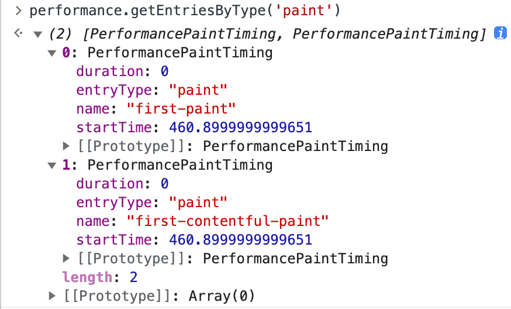

[W3C标准在Painting Time中提出](https://www.w3.org/TR/paint-timing/#first-contentful-paint)
前端常用的页面性能指标主要有5个
###### 1.First Paint (首次绘制时间)
从开始加载到浏览器首次绘制像素到屏幕上的时间，俗称"白屏时间"

在HTML5下，可以通过**Performance** API来获取
```
performance.getEntriesByName('first-paint')
```


返回值解释：
duration 为该事件的耗时
entryType 为性能指标实例的类型
name 为指标名称
startTime 为指标采集时间
###### 2.First Contentful Paint (首屏内容绘制)
浏览器首次绘制来自DOM的内容的时间，这个内容可以是文字、图片(也包括背景图片)、非空白的canvas和svg
```
performance.getEntriesByName('first-contentful-paint');
```


同时获得`first-paint`和`first-contentful-paint`的方法


FCP有时候会与FP相同，有时候会晚于FP，因为FP只需要满足`开始绘制`,而FCP需要满足`绘制的像素有内容`。

###### 3.Time To Interactive (可交互时间)
页面第一次完全达到可交互的时间点，页面都已经渲染完毕了，浏览器可以响应用户的操作。

简单计算可以用
```
performance.timing.loadEventEnd - performance.timing.navigationStart
```

或者可以使用 Google 提供的模块 tti-polyfill
```
import ttiPolyfill from 'tti-polyfill'; 

ttiPolyfill.getFirstConsistentlyInteractive(opts).then((tti) => { });
```

`performance.now()` 返回的是performance.timing.navigationStart到当前的毫秒数


###### 4.Total Blocking Time （总阻塞时间)
指阻塞用户响应(比如键盘输入、鼠标点击)的所有时间


###### 5.Largest Contentful Paint (最大内容绘制)
窗口内最大图像或者文本块的绘制时间

